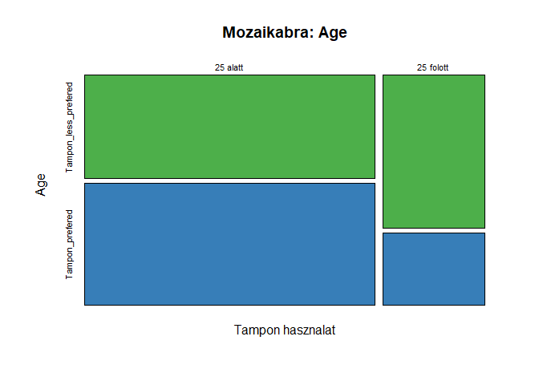
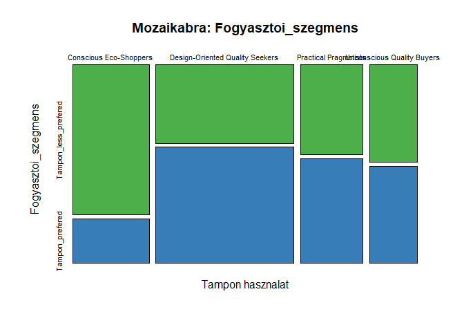
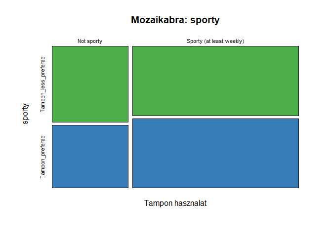
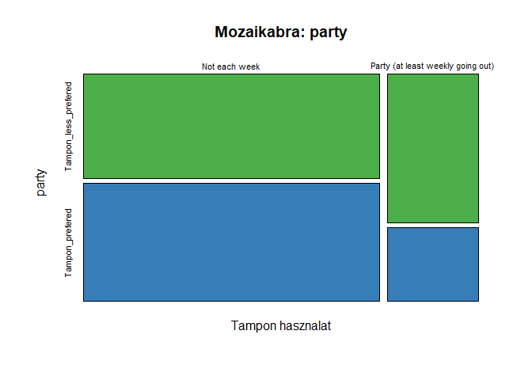
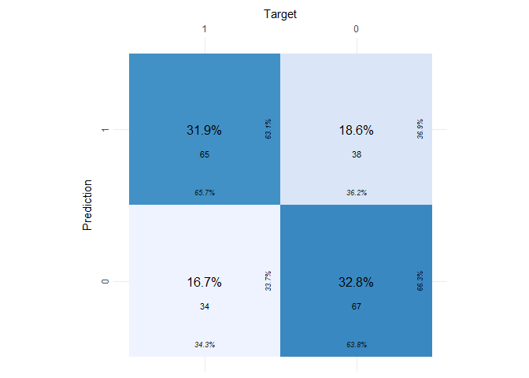
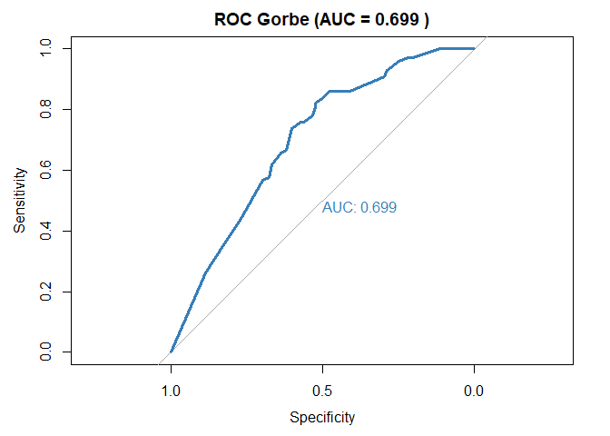

Classification
================
Nagy-Czirok László
2026-08-12

``` r
library(haven)
library(cvms)
library(gmodels)
library(broom)    
library(tibble)
library(pROC)
library(dplyr)
library(ggplot2)
library(scales)
library(tidyr)
library(marginaleffects)
library(mfx)
df=read_sav("model.sav")
```

Based on the question ‘Which product do you mainly use during your
period?’, the ‘Tampon_user_mainly’ status got created, which, in the
form of a binary variable, distinguishes between consumers who mainly
use tampons and those who do not. Firstly bivariate inferential tests
was used to identify the factors that can explain the
‘Tampon_user_mainly’ status variable. Finally, based on the results of
the tests, sought to quantify the effects of the variables with
significant explanatory power in relation to ‘Tampon_user_mainly’
variable using a classification technique (logit model was chosen, due
to the small number of obs).

``` r
#Target variable
prop.table(table(df$Tampon_user_mainly))
```

    ## 
    ## Tampon_less_prefered      Tampon_prefered 
    ##            0.5147059            0.4852941

Bivariate analysis

``` r
#Target vs potential explanatory variables
df$Age = ifelse(df$D2 ==1, "25 alatt", "25 folott")
colnames(df)[95] ="Fogyasztoi_szegmens"

vizsgalt_valtozok <- c("Age", "Fogyasztoi_szegmens", "sporty", "party")

for (valtozo in vizsgalt_valtozok) {
  
  # Cím kiírása ékezetek nélkül
  cat(paste0("\n\n---\n## Vizsgalat: **", valtozo, "** vs **Tampon_user_mainly**\n"))
  
  # Mozaikábra kirajzolása - MINDEN felirat ékezetmentesítve!
  form_mosaic <- as.formula(paste("df[[valtozo]] ~ df$Tampon_user_mainly"))
  mosaicplot(form_mosaic, 
             main = paste("Mozaikabra:", valtozo),
             xlab = "Tampon hasznalat", 
             ylab = valtozo,
             color = c("#4DAF4A", "#377EB8"))
  
  # Kereszttábla futtatása
  CrossTable(df[[valtozo]], df$Tampon_user_mainly,
             prop.c = FALSE, 
             prop.t = FALSE,
             chisq = TRUE)
  
  # Szignifikancia ellenőrzése
  teszt_eredmeny <- chisq.test(df[[valtozo]], df$Tampon_user_mainly)
  p_ertek <- teszt_eredmeny$p.value
  
  # Szöveges értékelés tiszta karakterekkel
  if (p_ertek < 0.05) {
    cat(paste0("\n\n> ### Eredmeny: A kapcsolat SZIGNIFIKANS! (p = ", round(p_ertek, 4), ")\n\n"))
  } else {
    cat(paste0("\n\n> ### Eredmeny: A kapcsolat NEM szignifikans. (p = ", round(p_ertek, 4), ")\n\n"))
  }
}
```

    ## 
    ## 
    ## ---
    ## ## Vizsgalat: **Age** vs **Tampon_user_mainly**

<!-- -->

    ## 
    ##  
    ##    Cell Contents
    ## |-------------------------|
    ## |                       N |
    ## | Chi-square contribution |
    ## |           N / Row Total |
    ## |-------------------------|
    ## 
    ##  
    ## Total Observations in Table:  204 
    ## 
    ##  
    ##               | df$Tampon_user_mainly 
    ## df[[valtozo]] | Tampon_less_prefered |      Tampon_prefered |            Row Total | 
    ## --------------|----------------------|----------------------|----------------------|
    ##      25 alatt |                   69 |                   82 |                  151 | 
    ##               |                0.978 |                1.038 |                      | 
    ##               |                0.457 |                0.543 |                0.740 | 
    ## --------------|----------------------|----------------------|----------------------|
    ##     25 folott |                   36 |                   17 |                   53 | 
    ##               |                2.788 |                2.957 |                      | 
    ##               |                0.679 |                0.321 |                0.260 | 
    ## --------------|----------------------|----------------------|----------------------|
    ##  Column Total |                  105 |                   99 |                  204 | 
    ## --------------|----------------------|----------------------|----------------------|
    ## 
    ##  
    ## Statistics for All Table Factors
    ## 
    ## 
    ## Pearson's Chi-squared test 
    ## ------------------------------------------------------------
    ## Chi^2 =  7.760769     d.f. =  1     p =  0.005339322 
    ## 
    ## Pearson's Chi-squared test with Yates' continuity correction 
    ## ------------------------------------------------------------
    ## Chi^2 =  6.896345     d.f. =  1     p =  0.008637215 
    ## 
    ##  
    ## 
    ## 
    ## > ### Eredmeny: A kapcsolat SZIGNIFIKANS! (p = 0.0086)
    ## 
    ## 
    ## 
    ## ---
    ## ## Vizsgalat: **Fogyasztoi_szegmens** vs **Tampon_user_mainly**

<!-- -->

    ## 
    ##  
    ##    Cell Contents
    ## |-------------------------|
    ## |                       N |
    ## | Chi-square contribution |
    ## |           N / Row Total |
    ## |-------------------------|
    ## 
    ##  
    ## Total Observations in Table:  204 
    ## 
    ##  
    ##                                 | df$Tampon_user_mainly 
    ##                   df[[valtozo]] | Tampon_less_prefered |      Tampon_prefered |            Row Total | 
    ## --------------------------------|----------------------|----------------------|----------------------|
    ##          Conscious Eco-Shoppers |                   37 |                   11 |                   48 | 
    ##                                 |                6.118 |                6.489 |                      | 
    ##                                 |                0.771 |                0.229 |                0.235 | 
    ## --------------------------------|----------------------|----------------------|----------------------|
    ## Design-Oriented Quality Seekers |                   35 |                   52 |                   87 | 
    ##                                 |                2.136 |                2.265 |                      | 
    ##                                 |                0.402 |                0.598 |                0.426 | 
    ## --------------------------------|----------------------|----------------------|----------------------|
    ##           Practical Pragmatists |                   18 |                   21 |                   39 | 
    ##                                 |                0.214 |                0.227 |                      | 
    ##                                 |                0.462 |                0.538 |                0.191 | 
    ## --------------------------------|----------------------|----------------------|----------------------|
    ##      Unconscious Quality Buyers |                   15 |                   15 |                   30 | 
    ##                                 |                0.013 |                0.013 |                      | 
    ##                                 |                0.500 |                0.500 |                0.147 | 
    ## --------------------------------|----------------------|----------------------|----------------------|
    ##                    Column Total |                  105 |                   99 |                  204 | 
    ## --------------------------------|----------------------|----------------------|----------------------|
    ## 
    ##  
    ## Statistics for All Table Factors
    ## 
    ## 
    ## Pearson's Chi-squared test 
    ## ------------------------------------------------------------
    ## Chi^2 =  17.47459     d.f. =  3     p =  0.0005644024 
    ## 
    ## 
    ##  
    ## 
    ## 
    ## > ### Eredmeny: A kapcsolat SZIGNIFIKANS! (p = 6e-04)
    ## 
    ## 
    ## 
    ## ---
    ## ## Vizsgalat: **sporty** vs **Tampon_user_mainly**

<!-- -->

    ## 
    ##  
    ##    Cell Contents
    ## |-------------------------|
    ## |                       N |
    ## | Chi-square contribution |
    ## |           N / Row Total |
    ## |-------------------------|
    ## 
    ##  
    ## Total Observations in Table:  204 
    ## 
    ##  
    ##                          | df$Tampon_user_mainly 
    ##            df[[valtozo]] | Tampon_less_prefered |      Tampon_prefered |            Row Total | 
    ## -------------------------|----------------------|----------------------|----------------------|
    ##               Not sporty |                   35 |                   29 |                   64 | 
    ##                          |                0.129 |                0.136 |                      | 
    ##                          |                0.547 |                0.453 |                0.314 | 
    ## -------------------------|----------------------|----------------------|----------------------|
    ## Sporty (at least weekly) |                   70 |                   70 |                  140 | 
    ##                          |                0.059 |                0.062 |                      | 
    ##                          |                0.500 |                0.500 |                0.686 | 
    ## -------------------------|----------------------|----------------------|----------------------|
    ##             Column Total |                  105 |                   99 |                  204 | 
    ## -------------------------|----------------------|----------------------|----------------------|
    ## 
    ##  
    ## Statistics for All Table Factors
    ## 
    ## 
    ## Pearson's Chi-squared test 
    ## ------------------------------------------------------------
    ## Chi^2 =  0.3863636     d.f. =  1     p =  0.534217 
    ## 
    ## Pearson's Chi-squared test with Yates' continuity correction 
    ## ------------------------------------------------------------
    ## Chi^2 =  0.2214889     d.f. =  1     p =  0.6379078 
    ## 
    ##  
    ## 
    ## 
    ## > ### Eredmeny: A kapcsolat NEM szignifikans. (p = 0.6379)
    ## 
    ## 
    ## 
    ## ---
    ## ## Vizsgalat: **party** vs **Tampon_user_mainly**

<!-- -->

    ## 
    ##  
    ##    Cell Contents
    ## |-------------------------|
    ## |                       N |
    ## | Chi-square contribution |
    ## |           N / Row Total |
    ## |-------------------------|
    ## 
    ##  
    ## Total Observations in Table:  204 
    ## 
    ##  
    ##                                   | df$Tampon_user_mainly 
    ##                     df[[valtozo]] | Tampon_less_prefered |      Tampon_prefered |            Row Total | 
    ## ----------------------------------|----------------------|----------------------|----------------------|
    ##                     Not each week |                   73 |                   83 |                  156 | 
    ##                                   |                0.663 |                0.703 |                      | 
    ##                                   |                0.468 |                0.532 |                0.765 | 
    ## ----------------------------------|----------------------|----------------------|----------------------|
    ## Party (at least weekly going out) |                   32 |                   16 |                   48 | 
    ##                                   |                2.154 |                2.284 |                      | 
    ##                                   |                0.667 |                0.333 |                0.235 | 
    ## ----------------------------------|----------------------|----------------------|----------------------|
    ##                      Column Total |                  105 |                   99 |                  204 | 
    ## ----------------------------------|----------------------|----------------------|----------------------|
    ## 
    ##  
    ## Statistics for All Table Factors
    ## 
    ## 
    ## Pearson's Chi-squared test 
    ## ------------------------------------------------------------
    ## Chi^2 =  5.802908     d.f. =  1     p =  0.01599969 
    ## 
    ## Pearson's Chi-squared test with Yates' continuity correction 
    ## ------------------------------------------------------------
    ## Chi^2 =  5.034615     d.f. =  1     p =  0.0248456 
    ## 
    ##  
    ## 
    ## 
    ## > ### Eredmeny: A kapcsolat SZIGNIFIKANS! (p = 0.0248)

Variable sport is not significant.

Modelling:

``` r
table(df$Tampon_user_mainly, as.factor(df$Tampon_user_mainly))
```

    ##                       
    ##                        Tampon_less_prefered Tampon_prefered
    ##   Tampon_less_prefered                  105               0
    ##   Tampon_prefered                         0              99

Tampon_prefered =1 based on the table

``` r
df <- df %>%
  mutate(
    Tampon_user_mainly  = as.factor(Tampon_user_mainly),
    Age                 = as.factor(Age),
    sporty              = as.factor(sporty),
    party               = as.factor(party),
    Fogyasztoi_szegmens = as.factor(Fogyasztoi_szegmens)
  )
logit <- glm(df$Tampon_user_mainly  ~ df$Age +df$sporty+df$party+ df$Fogyasztoi_szegmens, 
                  family=binomial(link=logit))
summary(logit)
```

    ## 
    ## Call:
    ## glm(formula = df$Tampon_user_mainly ~ df$Age + df$sporty + df$party + 
    ##     df$Fogyasztoi_szegmens, family = binomial(link = logit))
    ## 
    ## Coefficients:
    ##                                                       Estimate Std. Error
    ## (Intercept)                                            -0.9208     0.4358
    ## df$Age25 folott                                        -0.7289     0.3565
    ## df$sportySporty (at least weekly)                       0.1185     0.3297
    ## df$partyParty (at least weekly going out)              -0.8552     0.3706
    ## df$Fogyasztoi_szegmensDesign-Oriented Quality Seekers   1.6182     0.4197
    ## df$Fogyasztoi_szegmensPractical Pragmatists             1.2653     0.4805
    ## df$Fogyasztoi_szegmensUnconscious Quality Buyers        1.3691     0.5223
    ##                                                       z value Pr(>|z|)    
    ## (Intercept)                                            -2.113 0.034632 *  
    ## df$Age25 folott                                        -2.044 0.040914 *  
    ## df$sportySporty (at least weekly)                       0.359 0.719321    
    ## df$partyParty (at least weekly going out)              -2.308 0.021020 *  
    ## df$Fogyasztoi_szegmensDesign-Oriented Quality Seekers   3.856 0.000115 ***
    ## df$Fogyasztoi_szegmensPractical Pragmatists             2.633 0.008451 ** 
    ## df$Fogyasztoi_szegmensUnconscious Quality Buyers        2.621 0.008762 ** 
    ## ---
    ## Signif. codes:  0 '***' 0.001 '**' 0.01 '*' 0.05 '.' 0.1 ' ' 1
    ## 
    ## (Dispersion parameter for binomial family taken to be 1)
    ## 
    ##     Null deviance: 282.63  on 203  degrees of freedom
    ## Residual deviance: 252.75  on 197  degrees of freedom
    ## AIC: 266.75
    ## 
    ## Number of Fisher Scoring iterations: 4

``` r
#Odds ratios
exp(cbind(Odds_Ratio = coef(logit), confint(logit)))
```

    ##                                                       Odds_Ratio     2.5 %
    ## (Intercept)                                            0.3982116 0.1634663
    ## df$Age25 folott                                        0.4824472 0.2363101
    ## df$sportySporty (at least weekly)                      1.1257862 0.5888210
    ## df$partyParty (at least weekly going out)              0.4251800 0.2019676
    ## df$Fogyasztoi_szegmensDesign-Oriented Quality Seekers  5.0438947 2.2734603
    ## df$Fogyasztoi_szegmensPractical Pragmatists            3.5441984 1.4068233
    ## df$Fogyasztoi_szegmensUnconscious Quality Buyers       3.9317094 1.4361473
    ##                                                           97.5 %
    ## (Intercept)                                            0.9134732
    ## df$Age25 folott                                        0.9625568
    ## df$sportySporty (at least weekly)                      2.1535071
    ## df$partyParty (at least weekly going out)              0.8695181
    ## df$Fogyasztoi_szegmensDesign-Oriented Quality Seekers 11.8989297
    ## df$Fogyasztoi_szegmensPractical Pragmatists            9.3463170
    ## df$Fogyasztoi_szegmensUnconscious Quality Buyers      11.2621677

Clusters as expected. e.g. belonging to the group of Design-Oriented
Quality Seekers means five times more likely to prefer tampons than
those in the base segment (Conscious Eco-Shoppers)

``` r
#APEs (average partial effects)
ape <- logitmfx( Tampon_user_mainly~ Age + sporty + party + Fogyasztoi_szegmens, data = df)
print(ape)
```

    ## Call:
    ## logitmfx(formula = Tampon_user_mainly ~ Age + sporty + party + 
    ##     Fogyasztoi_szegmens, data = df)
    ## 
    ## Marginal Effects:
    ##                                                        dF/dx Std. Err.       z
    ## Age25 folott                                       -0.177047  0.082772 -2.1390
    ## sportySporty (at least weekly)                      0.029508  0.081956  0.3600
    ## partyParty (at least weekly going out)             -0.205442  0.083457 -2.4617
    ## Fogyasztoi_szegmensDesign-Oriented Quality Seekers  0.383790  0.089410  4.2925
    ## Fogyasztoi_szegmensPractical Pragmatists            0.300259  0.102112  2.9405
    ## Fogyasztoi_szegmensUnconscious Quality Buyers       0.318758  0.104596  3.0475
    ##                                                        P>|z|    
    ## Age25 folott                                        0.032437 *  
    ## sportySporty (at least weekly)                      0.718817    
    ## partyParty (at least weekly going out)              0.013830 *  
    ## Fogyasztoi_szegmensDesign-Oriented Quality Seekers 1.767e-05 ***
    ## Fogyasztoi_szegmensPractical Pragmatists            0.003277 ** 
    ## Fogyasztoi_szegmensUnconscious Quality Buyers       0.002308 ** 
    ## ---
    ## Signif. codes:  0 '***' 0.001 '**' 0.01 '*' 0.05 '.' 0.1 ' ' 1
    ## 
    ## dF/dx is for discrete change for the following variables:
    ## 
    ## [1] "Age25 folott"                                      
    ## [2] "sportySporty (at least weekly)"                    
    ## [3] "partyParty (at least weekly going out)"            
    ## [4] "Fogyasztoi_szegmensDesign-Oriented Quality Seekers"
    ## [5] "Fogyasztoi_szegmensPractical Pragmatists"          
    ## [6] "Fogyasztoi_szegmensUnconscious Quality Buyers"

Design-Oriented Quality Seekers: on average they are 38.4 percentage
points more likely to prefer tampons than members of the base segment

Model evaluation:

``` r
predicted_prob <- predict(ape$fit, type = "response") 
predicted_class <- ifelse(predicted_prob > 0.51, 1, 0)
actual_class <- ifelse(df$Tampon_user_mainly == "Tampon_prefered", 1, 0)
logit_k <- tibble(
  "target" = as.character(actual_class), 
  "prediction" = as.character(predicted_class)
)

#Confusion matrix
eval <- evaluate(logit_k,
                 target_col = "target",
                 prediction_cols = "prediction",
                 type = "binomial")

conf_mat <- eval$`Confusion Matrix`[[1]]
```

Confusion matrix

``` r
plot_confusion_matrix(conf_mat, 
                      target_col = "Target", 
                      prediction_col = "Prediction",
                      counts_col = "N")
```

<!-- -->

ROC curve

``` r
roc_obj <- roc(actual_class, predicted_prob)

# ROC Görbe kirajzolása
plot(roc_obj, 
     main = paste("ROC Gorbe (AUC =", round(auc(roc_obj), 3), ")"),
     col = "#377EB8", 
     lwd = 3, 
     print.auc = TRUE)
```

<!-- -->

The model indicates moderate, but acceptable predictive ability….quality
of survey data constrains the model quality
