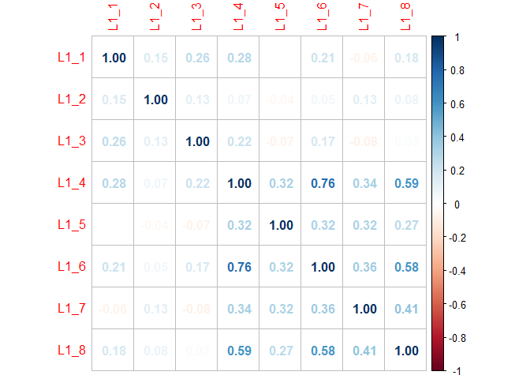
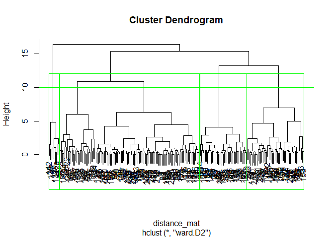
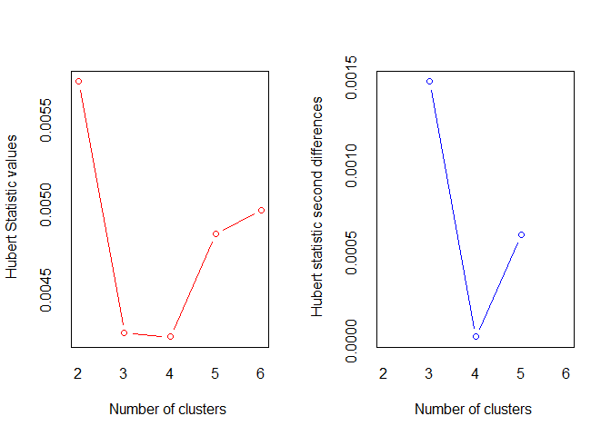
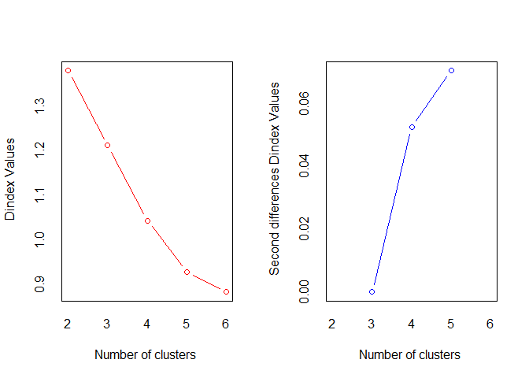
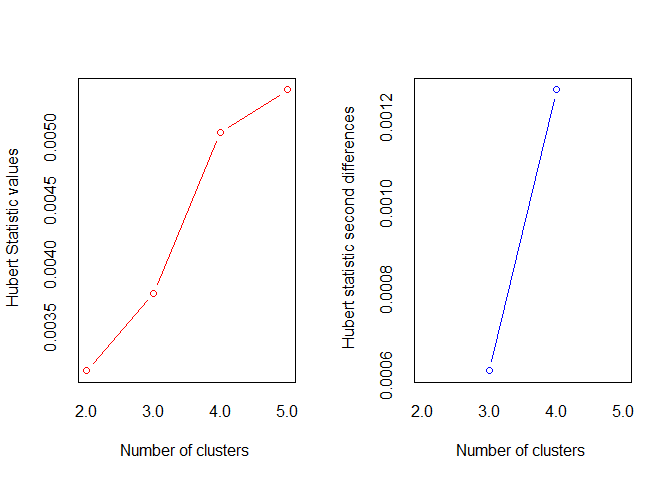
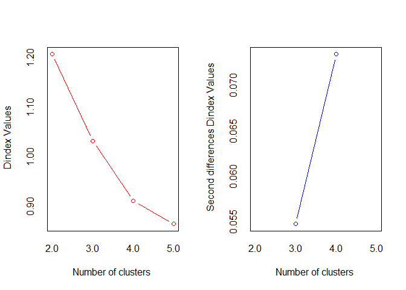

Consumer segmentation (based on factor and cluster analysis)
================
Nagy-Czirok László
2026-08-12

Loading database

``` r
df_válaszok_számkóddal <- read_sav("tampon_data_final.sav")
#df<-df %>% filter(df$TamponHasználó !=1)
```

Clustering based on factor analyis (whole sample)

``` r
#Function
kereszttabla_es_chisq <- function(data, var1, var2) {
  
  alap_tabla <- table(data[[var1]], data[[var2]], useNA = "no")
  szazalekos_tabla <- round(prop.table(alap_tabla, margin = 2) * 100, 2)
  chi_teszt <- chisq.test(alap_tabla)
  
  #output
  cat("==================================================================\n")
  cat(" KERESZTTÁBLA (Oszlopon belüli %-os megoszlás):\n")
  cat(" Sorok:", var1, " |  Oszlopok (Klaszterek):", var2, "\n")
  cat("==================================================================\n")
  print(szazalekos_tabla)
  
  cat("\n==================================================================\n")
  cat(" KHI-NÉGYZET PRÓBA EREDMÉNYE:\n")
  cat("==================================================================\n")
  cat("Khi-négyzet érték (X-squared):", round(chi_teszt$statistic, 4), "\n")
  cat("Szabadságfok (df):            ", chi_teszt$parameter, "\n")
  cat("P-érték (p-value):            ", format.pval(chi_teszt$p.value, digits = 4), "\n")
  
  # Figyelmeztetés, ha a Khi-négyzet feltételei sérülnének (kevés elemszám)
  if(any(chi_teszt$expected < 5)) {
    cat("\n FIGYELEM: Néhány cellában az elvárt gyakoriság 5 alatti!\n")
    cat("A p-érték pontatlan lehet, érdemes lehet Fisher-egzakt tesztet nézni.\n")
  }
  cat("==================================================================\n")
}
```

\#creating factoring based on likert variables

``` r
likerts<-df_válaszok_számkóddal %>% select(L1_1:L1_8) %>% filter(!is.na(L1_8))
describe(likerts)
```

    ##      vars   n mean   sd median trimmed  mad min max range  skew kurtosis   se
    ## L1_1    1 209 3.86 1.13      4    4.01 1.48   1   5     4 -1.04     0.25 0.08
    ## L1_2    2 209 2.93 1.13      3    2.96 1.48   1   5     4 -0.27    -0.83 0.08
    ## L1_3    3 209 3.53 1.14      4    3.61 1.48   1   5     4 -0.52    -0.49 0.08
    ## L1_4    4 209 4.68 0.76      5    4.86 0.00   1   5     4 -2.93     8.99 0.05
    ## L1_5    5 209 3.77 1.06      4    3.88 1.48   1   5     4 -0.70    -0.01 0.07
    ## L1_6    6 209 4.69 0.73      5    4.86 0.00   1   5     4 -3.03    10.15 0.05
    ## L1_7    7 209 3.63 1.06      4    3.73 1.48   1   5     4 -0.72     0.05 0.07
    ## L1_8    8 209 4.42 0.88      5    4.59 0.00   1   5     4 -1.75     3.20 0.06

``` r
likertek<-as.data.frame(likerts)
M<-cor(likertek)
corrplot(M, method = "number")
```

<!-- -->

``` r
KMO(M)  #overall MSA= 0.76 suitable for factor analysis
```

    ## Kaiser-Meyer-Olkin factor adequacy
    ## Call: KMO(r = M)
    ## Overall MSA =  0.76
    ## MSA for each item = 
    ## L1_1 L1_2 L1_3 L1_4 L1_5 L1_6 L1_7 L1_8 
    ## 0.70 0.54 0.63 0.73 0.84 0.75 0.77 0.84

``` r
cortest.bartlett(M) #H0 is rejected. 
```

    ## $chisq
    ## [1] 198.5124
    ## 
    ## $p.value
    ## [1] 1.310306e-27
    ## 
    ## $df
    ## [1] 28

``` r
#Both assumption checks gave the green light: KMO showed adequate sample size and shared variance (0.76), and Bartlett's test confirmed significant correlation among the variables (p < 0.001).
```

PCA \#determinig the number of factors

``` r
principal(likertek, nfactors = length(likertek), rotate="none")
```

    ## Principal Components Analysis
    ## Call: principal(r = likertek, nfactors = length(likertek), rotate = "none")
    ## Standardized loadings (pattern matrix) based upon correlation matrix
    ##       PC1   PC2   PC3   PC4   PC5   PC6   PC7   PC8 h2      u2 com
    ## L1_1 0.33  0.65 -0.10 -0.58  0.15  0.31 -0.03  0.03  1 2.2e-16 3.2
    ## L1_2 0.16  0.35  0.88 -0.04  0.09 -0.26 -0.01  0.00  1 8.9e-16 1.6
    ## L1_3 0.21  0.71 -0.13  0.60  0.21  0.13  0.14  0.02  1 3.3e-16 2.6
    ## L1_4 0.87  0.10 -0.16  0.03 -0.10 -0.16 -0.20 -0.35  1 6.7e-16 1.7
    ## L1_5 0.50 -0.42 -0.08 -0.06  0.74 -0.12  0.10  0.01  1 4.4e-16 2.6
    ## L1_6 0.86  0.03 -0.15  0.07 -0.14 -0.20 -0.26  0.32  1 7.8e-16 1.8
    ## L1_7 0.57 -0.42  0.38  0.18 -0.03  0.55 -0.12  0.00  1 1.2e-15 4.0
    ## L1_8 0.78 -0.10  0.02 -0.10 -0.31 -0.04  0.51  0.02  1 8.9e-16 2.2
    ## 
    ##                        PC1  PC2  PC3  PC4  PC5  PC6  PC7  PC8
    ## SS loadings           2.86 1.42 1.00 0.75 0.74 0.56 0.42 0.23
    ## Proportion Var        0.36 0.18 0.13 0.09 0.09 0.07 0.05 0.03
    ## Cumulative Var        0.36 0.54 0.66 0.76 0.85 0.92 0.97 1.00
    ## Proportion Explained  0.36 0.18 0.13 0.09 0.09 0.07 0.05 0.03
    ## Cumulative Proportion 0.36 0.54 0.66 0.76 0.85 0.92 0.97 1.00
    ## 
    ## Mean item complexity =  2.5
    ## Test of the hypothesis that 8 components are sufficient.
    ## 
    ## The root mean square of the residuals (RMSR) is  0 
    ##  with the empirical chi square  0  with prob <  NA 
    ## 
    ## Fit based upon off diagonal values = 1

``` r
#by PC3 Cumulative Var is greater than 0.6
```

Starting from 3..

``` r
pc3 =psych::principal(likertek, nfactors=3, rotate = "varimax", scores = TRUE)
# Sanity check
pc3$residual #condition: Less than half of residuals with absolute values > 0.05
```

    ##             L1_1        L1_2        L1_3        L1_4        L1_5        L1_6
    ## L1_1  0.45594918 -0.04261849 -0.28229096 -0.08624281  0.10763899 -0.10392798
    ## L1_2 -0.04261849  0.07801840 -0.03967677  0.03400447  0.10124318  0.03913982
    ## L1_3 -0.28229096 -0.03967677  0.44107737 -0.05743936  0.11262439 -0.04651756
    ## L1_4 -0.08624281  0.03400447 -0.05743936  0.20278076 -0.08165958 -0.01240461
    ## L1_5  0.10763899  0.10124318  0.11262439 -0.08165958  0.56947273 -0.10933091
    ## L1_6 -0.10392798  0.03913982 -0.04651756 -0.01240461 -0.10933091  0.23895330
    ## L1_7  0.06494146 -0.15076234  0.15379137 -0.05303100 -0.11288027 -0.06321136
    ## L1_8 -0.01504155 -0.02282084 -0.05811584 -0.07688565 -0.16536700 -0.08431377
    ##             L1_7        L1_8
    ## L1_1  0.06494146 -0.01504155
    ## L1_2 -0.15076234 -0.02282084
    ## L1_3  0.15379137 -0.05811584
    ## L1_4 -0.05303100 -0.07688565
    ## L1_5 -0.11288027 -0.16536700
    ## L1_6 -0.06321136 -0.08431377
    ## L1_7  0.34765272 -0.09037564
    ## L1_8 -0.09037564  0.37548342

``` r
pc3$fit # condition: Model fit > .9
```

    ## [1] 0.8710058

``` r
pc3$communality #condition: All communalities > .7
```

    ##      L1_1      L1_2      L1_3      L1_4      L1_5      L1_6      L1_7      L1_8 
    ## 0.5440508 0.9219816 0.5589226 0.7972192 0.4305273 0.7610467 0.6523473 0.6245166

``` r
pc3
```

    ## Principal Components Analysis
    ## Call: psych::principal(r = likertek, nfactors = 3, rotate = "varimax", 
    ##     scores = TRUE)
    ## Standardized loadings (pattern matrix) based upon correlation matrix
    ##       RC1   RC2   RC3   h2    u2 com
    ## L1_1 0.13  0.72  0.09 0.54 0.456 1.1
    ## L1_2 0.00  0.15  0.95 0.92 0.078 1.1
    ## L1_3 0.00  0.75  0.05 0.56 0.441 1.0
    ## L1_4 0.81  0.37 -0.02 0.80 0.203 1.4
    ## L1_5 0.60 -0.24 -0.11 0.43 0.569 1.4
    ## L1_6 0.82  0.29 -0.03 0.76 0.239 1.3
    ## L1_7 0.64 -0.34  0.35 0.65 0.348 2.1
    ## L1_8 0.78  0.11  0.10 0.62 0.375 1.1
    ## 
    ##                        RC1  RC2  RC3
    ## SS loadings           2.73 1.50 1.06
    ## Proportion Var        0.34 0.19 0.13
    ## Cumulative Var        0.34 0.53 0.66
    ## Proportion Explained  0.52 0.28 0.20
    ## Cumulative Proportion 0.52 0.80 1.00
    ## 
    ## Mean item complexity =  1.3
    ## Test of the hypothesis that 3 components are sufficient.
    ## 
    ## The root mean square of the residuals (RMSR) is  0.07 
    ##  with the empirical chi square  59.68  with prob <  1.7e-10 
    ## 
    ## Fit based upon off diagonal values = 0.94

``` r
pc5 =psych::principal(likertek, nfactors=5, rotate = "varimax", scores = TRUE)
# Sanity check
pc5$residual #condition: Less than half of residuals with absolute values > 0.05
```

    ##             L1_1         L1_2          L1_3         L1_4          L1_5
    ## L1_1  0.09608111 -0.079146638  0.0360986165 -0.053098961 -3.905480e-02
    ## L1_2 -0.07914664  0.067524078 -0.0360886938  0.044672389  2.898022e-02
    ## L1_3  0.03609862 -0.036088694  0.0377622191 -0.055844048 -4.690827e-04
    ## L1_4 -0.05309896  0.044672389 -0.0558440480  0.191868002 -6.404442e-03
    ## L1_5 -0.03905480  0.028980223 -0.0004690827 -0.006404442  2.465030e-02
    ## L1_6 -0.04284833  0.055317998 -0.0583154187 -0.028768721 -7.694127e-05
    ## L1_7  0.17216312 -0.140781635  0.0551064507 -0.061934575 -7.680508e-02
    ## L1_8 -0.02842380  0.002907959  0.0683931988 -0.104804299  5.817025e-02
    ##               L1_6        L1_7         L1_8
    ## L1_1 -4.284833e-02  0.17216312 -0.028423801
    ## L1_2  5.531800e-02 -0.14078164  0.002907959
    ## L1_3 -5.831542e-02  0.05510645  0.068393199
    ## L1_4 -2.876872e-02 -0.06193458 -0.104804299
    ## L1_5 -7.694127e-05 -0.07680508  0.058170246
    ## L1_6  2.139151e-01 -0.08008254 -0.121868924
    ## L1_7 -8.008254e-02  0.31558625 -0.082785281
    ## L1_8 -1.218689e-01 -0.08278528  0.266872947

``` r
pc5$fit # condition: Model fit > .9
```

    ## [1] 0.9576511

``` r
pc5$communality #condition: All communalities > .7
```

    ##      L1_1      L1_2      L1_3      L1_4      L1_5      L1_6      L1_7      L1_8 
    ## 0.9039189 0.9324759 0.9622378 0.8081320 0.9753497 0.7860849 0.6844138 0.7331271

``` r
# PC5 better than PC3 numerically, but PC3 better for practical reasons

#based on PC3
#RC1 (from 5 variables): higénikus használat, nagy kiszerelés, megfelelő minőség, márka ismerete, könnyű használat --->"Importance of quality and practical utility': gyakorlati és minőségi elvárásokat tömöríti.
#Rc2 (from 2 variables): ár, fenntarthatóság -->"Conscious & Value-Driven consumers": összeköti a modern, tudatos vásárló két legfontosabb szempontját
#Rc3 (from 1 variables): eszétikus csomagolás --> "Importance of aesthetic design"
```

``` r
#technical issue
seged <- data.frame(matrix(NA, nrow = 4, ncol = 3))
colnames(seged)<-colnames(pc3$scores)
factors=rbind(seged, pc3$scores) 

colnames(factors)<- c("Importance_of_quality_and_practical_utility","Conscious_Value-Driven_consumers","Importance_of_aesthetic_design")
df_válaszok_számkóddal = cbind(df_válaszok_számkóddal, factors)
#sanity check
summary(df_válaszok_számkóddal[,112:114])
```

    ##  Importance_of_quality_and_practical_utility Conscious_Value-Driven_consumers
    ##  Min.   :-4.8989                             Min.   :-2.86450                
    ##  1st Qu.:-0.3212                             1st Qu.:-0.63521                
    ##  Median : 0.2277                             Median : 0.05859                
    ##  Mean   : 0.0000                             Mean   : 0.00000                
    ##  3rd Qu.: 0.6158                             3rd Qu.: 0.68257                
    ##  Max.   : 1.3543                             Max.   : 2.37384                
    ##  NA's   :4                                   NA's   :4                       
    ##  Importance_of_aesthetic_design
    ##  Min.   :-2.60888              
    ##  1st Qu.:-0.71867              
    ##  Median : 0.09884              
    ##  Mean   : 0.00000              
    ##  3rd Qu.: 0.77457              
    ##  Max.   : 2.24646              
    ##  NA's   :4

``` r
round(cor(df_válaszok_számkóddal[,112:114], use = "complete.obs"), 5)#okkk
```

    ##                                             Importance_of_quality_and_practical_utility
    ## Importance_of_quality_and_practical_utility                                           1
    ## Conscious_Value-Driven_consumers                                                      0
    ## Importance_of_aesthetic_design                                                        0
    ##                                             Conscious_Value-Driven_consumers
    ## Importance_of_quality_and_practical_utility                                0
    ## Conscious_Value-Driven_consumers                                           1
    ## Importance_of_aesthetic_design                                             0
    ##                                             Importance_of_aesthetic_design
    ## Importance_of_quality_and_practical_utility                              0
    ## Conscious_Value-Driven_consumers                                         0
    ## Importance_of_aesthetic_design                                           1

``` r
#impute NA's in factor variables (only 4 rows with NAs)
for(col in colnames(factors)) {
  atlag_ertek <- mean(df_válaszok_számkóddal[[col]], na.rm = TRUE)
  df_válaszok_számkóddal[[col]][is.na(df_válaszok_számkóddal[[col]])] <- atlag_ertek
}
# ellenőrzés
sum(is.na(df_válaszok_számkóddal[, colnames(factors)]))
```

    ## [1] 0

Creating clusters based on the factors

``` r
#Fitting Hierarchical clustering Model (no ML technique due to the low number of obs.)
distance_mat <- dist(df_válaszok_számkóddal[,112:114], method = 'euclidean')
#distance_mat
Hierar_cl <- hclust(distance_mat, method = "ward.D2")
# Plotting dendrogram
plot(Hierar_cl)
# Choosing no. of clusters
abline(h = 10, col = "green") # 4, ha összevonásnál maximum 10 távolságot engedünk meg
# Cutting tree by no. of clusters
fit_3 <- cutree(Hierar_cl, k = 3)
table(fit_3) 
```

    ## fit_3
    ##   1   2   3 
    ## 117  87   9

``` r
fit_4 <- cutree(Hierar_cl, k = 4)
table(fit_4) 
```

    ## fit_4
    ##   1   2   3   4 
    ## 117  48   9  39

``` r
rect.hclust(Hierar_cl, k = 4, border = "green")
```

<!-- -->

``` r
szavazas <- NbClust(
  data = df_válaszok_számkóddal[, 112:114], 
  distance = "euclidean", 
  min.nc = 2, 
  max.nc = 6, 
  method = "ward.D2"
)
```

<!-- -->

    ## *** : The Hubert index is a graphical method of determining the number of clusters.
    ##                 In the plot of Hubert index, we seek a significant knee that corresponds to a 
    ##                 significant increase of the value of the measure i.e the significant peak in Hubert
    ##                 index second differences plot. 
    ## 

<!-- -->

    ## *** : The D index is a graphical method of determining the number of clusters. 
    ##                 In the plot of D index, we seek a significant knee (the significant peak in Dindex
    ##                 second differences plot) that corresponds to a significant increase of the value of
    ##                 the measure. 
    ##  
    ## ******************************************************************* 
    ## * Among all indices:                                                
    ## * 11 proposed 2 as the best number of clusters 
    ## * 3 proposed 3 as the best number of clusters 
    ## * 1 proposed 4 as the best number of clusters 
    ## * 8 proposed 5 as the best number of clusters 
    ## * 1 proposed 6 as the best number of clusters 
    ## 
    ##                    ***** Conclusion *****                            
    ##  
    ## * According to the majority rule, the best number of clusters is  2 
    ##  
    ##  
    ## *******************************************************************

``` r
szavazas$Best.nc #based on the majority rule, the best number of clusters is  2 
```

    ##                      KL      CH Hartigan     CCC    Scott Marriot   TrCovW
    ## Number_clusters  2.0000  5.0000   5.0000  5.0000   3.0000       5     3.00
    ## Value_Index     35.3186 92.7365  30.5257 -2.4849 178.5121 4142085 17448.37
    ##                  TraceW Friedman   Rubin Cindex     DB Silhouette   Duda
    ## Number_clusters  5.0000   5.0000  5.0000 5.0000 2.0000     2.0000 2.0000
    ## Value_Index     35.5073   2.1867 -0.2497 0.2665 0.7467     0.5369 0.7495
    ##                 PseudoT2  Beale Ratkowsky     Ball PtBiserial   Frey McClain
    ## Number_clusters   2.0000 2.0000    4.0000   3.0000     2.0000 2.0000  2.0000
    ## Value_Index      67.5225 0.5663    0.3676 120.9321     0.5699 5.5927  0.0404
    ##                   Dunn Hubert SDindex Dindex   SDbw
    ## Number_clusters 2.0000      0  2.0000      0 6.0000
    ## Value_Index     0.2008      0  1.6067      0 0.5968

``` r
#11 proposed 2 as the best number of clusters 
#3 proposed 3 as the best number of clusters 
```

``` r
# 2-klaszteres verzió kimentése és átlagai
df_válaszok_számkóddal$klaszter_2 <- cutree(Hierar_cl, k = 2)
aggregate(df_válaszok_számkóddal[, 112:114], by=list(df_válaszok_számkóddal$klaszter_2), mean)
```

    ##   Group.1 Importance_of_quality_and_practical_utility
    ## 1       1                                   0.1485471
    ## 2       2                                  -3.3670667
    ##   Conscious_Value-Driven_consumers Importance_of_aesthetic_design
    ## 1                       0.07606508                  -0.0005629189
    ## 2                      -1.72414179                   0.0127594952

``` r
# 3-klaszteres verzió átlagai (összehasonlításképp)
df_válaszok_számkóddal$klaszter_3 <- cutree(Hierar_cl, k = 3)
aggregate(df_válaszok_számkóddal[, 112:114], by=list(df_válaszok_számkóddal$klaszter_3), mean)
```

    ##   Group.1 Importance_of_quality_and_practical_utility
    ## 1       1                                   0.4052045
    ## 2       2                                  -0.1966130
    ## 3       3                                  -3.3670667
    ##   Conscious_Value-Driven_consumers Importance_of_aesthetic_design
    ## 1                       -0.4216955                      0.3408950
    ## 2                        0.7454673                     -0.4597650
    ## 3                       -1.7241418                      0.0127595

``` r
table(df_válaszok_számkóddal$klaszter_3)
```

    ## 
    ##   1   2   3 
    ## 117  87   9

``` r
table(df_válaszok_számkóddal$klaszter_2) 
```

    ## 
    ##   1   2 
    ## 204   9

We have 9 outlier, the “The Radical Rejectors”, that have extremely low
and negative values of each factor variable

\####Clustering without the small number (9) of outliers

``` r
df_clean <- subset(df_válaszok_számkóddal, klaszter_2 == 1)

szavazas_clean <- NbClust(
  data = df_clean[, 112:114], 
  distance = "euclidean", 
  min.nc = 2, 
  max.nc = 5, 
  method = "ward.D2"
)
```

<!-- -->

    ## *** : The Hubert index is a graphical method of determining the number of clusters.
    ##                 In the plot of Hubert index, we seek a significant knee that corresponds to a 
    ##                 significant increase of the value of the measure i.e the significant peak in Hubert
    ##                 index second differences plot. 
    ## 

<!-- -->

    ## *** : The D index is a graphical method of determining the number of clusters. 
    ##                 In the plot of D index, we seek a significant knee (the significant peak in Dindex
    ##                 second differences plot) that corresponds to a significant increase of the value of
    ##                 the measure. 
    ##  
    ## ******************************************************************* 
    ## * Among all indices:                                                
    ## * 4 proposed 2 as the best number of clusters 
    ## * 7 proposed 3 as the best number of clusters 
    ## * 9 proposed 4 as the best number of clusters 
    ## * 3 proposed 5 as the best number of clusters 
    ## 
    ##                    ***** Conclusion *****                            
    ##  
    ## * According to the majority rule, the best number of clusters is  4 
    ##  
    ##  
    ## *******************************************************************

``` r
szavazas_clean$Best.nc # 4 cluster
```

    ##                      KL     CH Hartigan     CCC   Scott Marriot   TrCovW
    ## Number_clusters  2.0000  4.000   4.0000  2.0000   4.000       4    3.000
    ## Value_Index     10.4605 85.957  31.7015 -3.8269 161.994 1765548 9775.601
    ##                  TraceW Friedman   Rubin Cindex    DB Silhouette   Duda
    ## Number_clusters  4.0000   4.0000  4.0000 4.0000 3.000     4.0000 3.0000
    ## Value_Index     35.5073   1.9815 -0.2134 0.2656 1.242     0.2903 0.6426
    ##                 PseudoT2 Beale Ratkowsky    Ball PtBiserial Frey McClain   Dunn
    ## Number_clusters   3.0000 2.000    3.0000  3.0000     5.0000    1  2.0000 5.0000
    ## Value_Index      63.9563 1.496    0.3758 88.0984     0.5309   NA  0.7017 0.0803
    ##                 Hubert SDindex Dindex   SDbw
    ## Number_clusters      0  3.0000      0 5.0000
    ## Value_Index          0  1.5664      0 0.6857

4 cluster recommended.

``` r
#Új távolságmátrix és hierarchikus modell létrehozása a celan (204 válaszadós) adatokon
tavolsag_tiszta <- dist(df_clean[, 112:114], method = "euclidean")
Hierar_cl_tiszta <- hclust(tavolsag_tiszta, method = "ward.D2")
# A 4-klaszteres (matematikai győztes) verzió kimentése és átlagai
df_clean$klaszter_4 <- cutree(Hierar_cl_tiszta, k = 4)
cat("\n--- 4 KLASZTER ELEMSZÁMAI ---\n")
```

    ## 
    ## --- 4 KLASZTER ELEMSZÁMAI ---

``` r
print(table(df_clean$klaszter_4))
```

    ## 
    ##  1  2  3  4 
    ## 87 30 48 39

``` r
cat("\n--- 4 KLASZTER ÁTLAGAI ---\n")
```

    ## 
    ## --- 4 KLASZTER ÁTLAGAI ---

``` r
table(df_clean$klaszter_4)
```

    ## 
    ##  1  2  3  4 
    ## 87 30 48 39

``` r
print(aggregate(df_clean[, 112:114], by=list(df_clean$klaszter_4), mean))
```

    ##   Group.1 Importance_of_quality_and_practical_utility
    ## 1       1                                   0.3155337
    ## 2       2                                   0.6652499
    ## 3       3                                  -0.5691179
    ## 4       4                                   0.2618545
    ##   Conscious_Value-Driven_consumers Importance_of_aesthetic_design
    ## 1                      -0.07670012                      0.5611105
    ## 2                      -1.42218220                     -0.2977299
    ## 3                       1.14418294                      0.2625270
    ## 4                       0.25474030                     -1.3487396

``` r
aggregate(df_clean[, c("Importance_of_quality_and_practical_utility", "Conscious_Value-Driven_consumers", "Importance_of_aesthetic_design")], 
          by=list(df_clean$klaszter_4), mean) #
```

    ##   Group.1 Importance_of_quality_and_practical_utility
    ## 1       1                                   0.3155337
    ## 2       2                                   0.6652499
    ## 3       3                                  -0.5691179
    ## 4       4                                   0.2618545
    ##   Conscious_Value-Driven_consumers Importance_of_aesthetic_design
    ## 1                      -0.07670012                      0.5611105
    ## 2                      -1.42218220                     -0.2977299
    ## 3                       1.14418294                      0.2625270
    ## 4                       0.25474030                     -1.3487396

``` r
aggregate(df_clean[, c("Importance_of_quality_and_practical_utility", "Conscious_Value-Driven_consumers", "Importance_of_aesthetic_design")], 
          by=list(df_clean$klaszter_4), sd) #homogenitiy inside the cluster across all factors
```

    ##   Group.1 Importance_of_quality_and_practical_utility
    ## 1       1                                   0.4578970
    ## 2       2                                   0.4848866
    ## 3       3                                   0.6463990
    ## 4       4                                   0.5316904
    ##   Conscious_Value-Driven_consumers Importance_of_aesthetic_design
    ## 1                        0.4733463                      0.5631443
    ## 2                        0.5531665                      0.9620582
    ## 3                        0.5266712                      0.8990665
    ## 4                        0.5108118                      0.4401974

Names for the clusters

``` r
df_clean$klaszter_4_named <- ifelse(df_clean$klaszter_4 == 1, "Design-Oriented Quality Seekers",
                                    ifelse(df_clean$klaszter_4 == 2, "Unconscious Quality Buyers",
                                           ifelse(df_clean$klaszter_4 == 3, "Conscious Eco-Shoppers", "Practical Pragmatists")))

prop.table(table(df_clean$klaszter_4))
```

    ## 
    ##         1         2         3         4 
    ## 0.4264706 0.1470588 0.2352941 0.1911765

``` r
prop.table(table(df_clean$klaszter_4_named))
```

    ## 
    ##          Conscious Eco-Shoppers Design-Oriented Quality Seekers 
    ##                       0.2352941                       0.4264706 
    ##           Practical Pragmatists      Unconscious Quality Buyers 
    ##                       0.1911765                       0.1470588

``` r
unique(df_clean$klaszter_4_named)
```

    ## [1] "Design-Oriented Quality Seekers" "Unconscious Quality Buyers"     
    ## [3] "Conscious Eco-Shoppers"          "Practical Pragmatists"

``` r
#1.Design-Oriented Quality Seekers: a célcsoport legnagyobb és legértékesebb (?) része elvárt a magas minőség, a higiénikus és könnyű használat,  mindezt esztétikus csomagolásban. nem kifejezetten árérzékenyek és a fenntarthatóság sem elsődleges szempont  
#--->prémium pozicionálás ideális célpontjai

#2.Unconscious Quality Buyers: nagyon határozottan pragmatikus csoport.  a környezettudatosság vagy az akciós árak, és a csomagolás dizájnjára is felesleges nekik Számukra egyetlen dolog számít: a termék legyen kiváló minőségű, praktikus, jól működő és megbízható márka. 
#--->hajlandóak sokat fizetni a tiszta funkcionalitásért (?)

#3.Conscious Eco-Shoppers: modern, értékvezérelt fogyasztók   az ár-érték arány és a fenntarthatóság minden más szemponton felül. 
#--->hajlandóak kompromisszumot kötni a termék kényelmes vagy praktikus használatában (pl. elfogadják a kevésbé higiénikus, de környezetbarátabb megoldásokat), ha tudják, hogy azzal védik a környezetet vagy spórolnak. Emellett értékelik, ha a zöld dizájn esztétikus is.

#4. Practical Pragmatists:  puritán csoport.  csomagolás külseje  lényegtelen, szinte teljesen elutasítják a vizuális dizájn fontosságát.
#-->a termék legyen  olcsó és fenntartható és nyújtson egy alapvető, elvárható praktikumot
```

Profiling clusters based on general characteristics, habits and
variables related to the product of the scope

``` r
#Kereszttábla és Chi-négyzet: sport
df_clean$sporty <- ifelse(df_clean$K1 >2, "Sporty (at least weekly)", "Not sporty")

kereszttabla_es_chisq(df_clean, "sporty","klaszter_4_named")
```

    ## ==================================================================
    ##  KERESZTTÁBLA (Oszlopon belüli %-os megoszlás):
    ##  Sorok: sporty  |  Oszlopok (Klaszterek): klaszter_4_named 
    ## ==================================================================
    ##                           
    ##                            Conscious Eco-Shoppers
    ##   Not sporty                                31.25
    ##   Sporty (at least weekly)                  68.75
    ##                           
    ##                            Design-Oriented Quality Seekers
    ##   Not sporty                                         32.18
    ##   Sporty (at least weekly)                           67.82
    ##                           
    ##                            Practical Pragmatists Unconscious Quality Buyers
    ##   Not sporty                               23.08                      40.00
    ##   Sporty (at least weekly)                 76.92                      60.00
    ## 
    ## ==================================================================
    ##  KHI-NÉGYZET PRÓBA EREDMÉNYE:
    ## ==================================================================
    ## Khi-négyzet érték (X-squared): 2.3106 
    ## Szabadságfok (df):             3 
    ## P-érték (p-value):             0.5105 
    ## ==================================================================

no connection..

``` r
#Kereszttábla és Chi-négyzet: buli
df_clean$party <- ifelse(df_clean$K2 <2, "Party (at least weekly going out)", "Not each week")

kereszttabla_es_chisq(df_clean, "party","klaszter_4_named") # no connection
```

    ## ==================================================================
    ##  KERESZTTÁBLA (Oszlopon belüli %-os megoszlás):
    ##  Sorok: party  |  Oszlopok (Klaszterek): klaszter_4_named 
    ## ==================================================================
    ##                                    
    ##                                     Conscious Eco-Shoppers
    ##   Not each week                                      79.17
    ##   Party (at least weekly going out)                  20.83
    ##                                    
    ##                                     Design-Oriented Quality Seekers
    ##   Not each week                                               74.71
    ##   Party (at least weekly going out)                           25.29
    ##                                    
    ##                                     Practical Pragmatists
    ##   Not each week                                     84.62
    ##   Party (at least weekly going out)                 15.38
    ##                                    
    ##                                     Unconscious Quality Buyers
    ##   Not each week                                          66.67
    ##   Party (at least weekly going out)                      33.33
    ## 
    ## ==================================================================
    ##  KHI-NÉGYZET PRÓBA EREDMÉNYE:
    ## ==================================================================
    ## Khi-négyzet érték (X-squared): 3.3838 
    ## Szabadságfok (df):             3 
    ## P-érték (p-value):             0.3362 
    ## ==================================================================

``` r
#Kereszttábla és Chi-négyzet: tampon_user vs nem tampon_user
df_clean$Tampon_user_mainly <- ifelse(df_clean$K3 == 1, "Tampon_prefered", "Tampon_less_prefered")

kereszttabla_es_chisq(df_clean, "Tampon_user_mainly","klaszter_4_named") #  connection!!
```

    ## ==================================================================
    ##  KERESZTTÁBLA (Oszlopon belüli %-os megoszlás):
    ##  Sorok: Tampon_user_mainly  |  Oszlopok (Klaszterek): klaszter_4_named 
    ## ==================================================================
    ##                       
    ##                        Conscious Eco-Shoppers Design-Oriented Quality Seekers
    ##   Tampon_less_prefered                  77.08                           40.23
    ##   Tampon_prefered                       22.92                           59.77
    ##                       
    ##                        Practical Pragmatists Unconscious Quality Buyers
    ##   Tampon_less_prefered                 46.15                      50.00
    ##   Tampon_prefered                      53.85                      50.00
    ## 
    ## ==================================================================
    ##  KHI-NÉGYZET PRÓBA EREDMÉNYE:
    ## ==================================================================
    ## Khi-négyzet érték (X-squared): 17.4746 
    ## Szabadságfok (df):             3 
    ## P-érték (p-value):             0.0005644 
    ## ==================================================================

``` r
#---> among Conscious Eco-Shoppers tampon is used less frequently
#---> among Unconscious Quality Buyers and Practical pragmatist, the preference  is basically  uniform 
#---> among Design-Oriented Quality Seekers tampon is more prefered
```

``` r
#rmarkdown::render("Consumer segmentation (factor and cluster analysis).Rmd")
```

``` r
#df_clean_print = df_clean [,c(1:93,117:121)]
#write_sav(df_clean_print , "model.sav")
```
